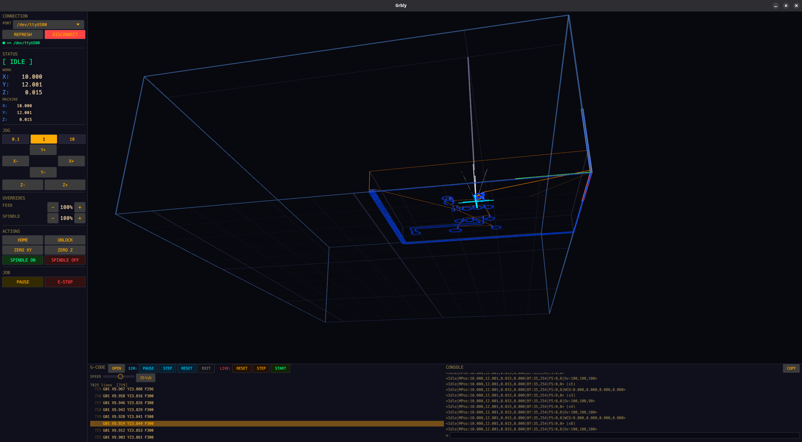
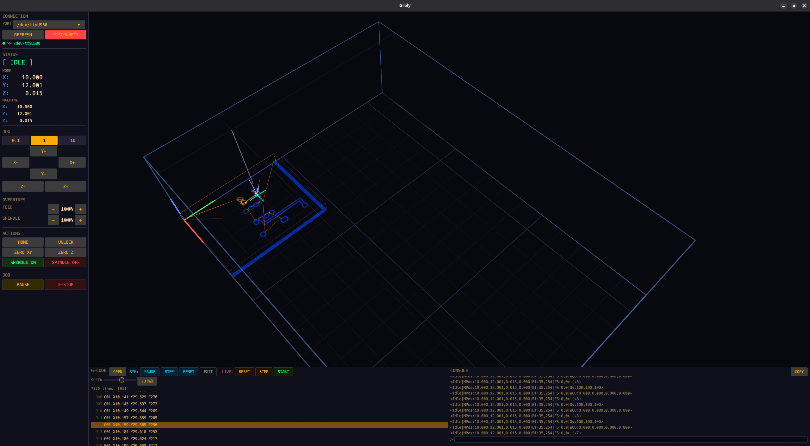

# Grbly

Small GRBL sender and visualizer for Linux desktop use.

```
cargo run
```

## Current Shape

- Serial connection to GRBL controllers.
- Live jog, feed/spindle overrides, homing/unlock/zero actions, soft reset, and job streaming.
- G-code preview with machine/material bounds and soft-limit line highlighting.
- Separate simulation mode that does not mutate the live job status.
- Compact tabs for Run, Jog, Setup, and Material controls.

## Safety Notes

- Live job start and spindle start require a second click.
- Jog and setup controls are disabled when the machine is disconnected or in an incompatible GRBL state.
- Soft-limit checks use GRBL travel settings `$130`, `$131`, `$132`, WCO, and `$20`.
- This is still a hobby controller; verify motion on your machine before trusting unattended cuts.

## Known Limits

- G-code preview supports common linear moves, XY arcs with `I/J` or `R`, absolute/incremental coordinates, and inch/mm scaling.
- More advanced modal behavior, non-XY planes, cutter compensation, and probing workflows are not complete.



